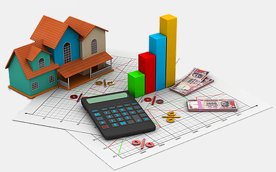

<h1 align="center">Visual-Aided House Price Prediction</h1>

This analysis is a toy example on how to leverage visual features to improve house price prediction accuracy. The analysis contains two main steps: first we try to predict house price using just textual features, then we use deep convoluted neural networks to extract additional features from house images and show that it can significantly increase model accuracy.

## Analysis

Details can be found at [Housing_price_analysis.ipynb](Housing_price_analysis.ipynb)

## Required packages

In order to run above notebook, you would need the following packages:

1. Pandas
2. Matplotlib
3. Numpy
4. Scipy
5. Scikit-Learn
6. Tensorflow
7. Keras

## Dataset

We use the dataset from [https://github.com/emanhamed/Houses-dataset](https://github.com/emanhamed/Houses-dataset)

This is a benchmark dataset for houses prices that contains both visual and textual information. Each house is represened by four images for bedroom, bathroom, kitchen and a frontal image of the house. This is the first dataset that contains images to be used for houses prices estimation. The dataset folder contains 2140 images, 4 images for each house. Also, it contains a text file that contains the textual metadata of the dataset. Each row in the file respesents the number of house in order. The numbers represent number of bedrooms, number of bathrooms, area of the house, zipcode and the price.

## Author

* Huy Nguyen
